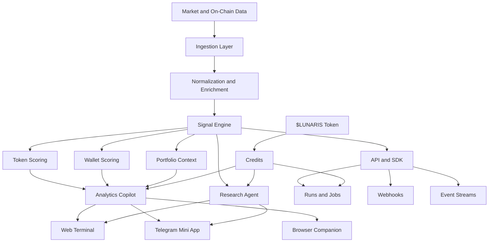
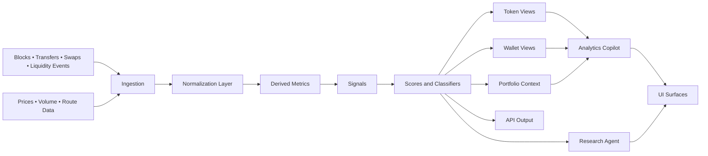
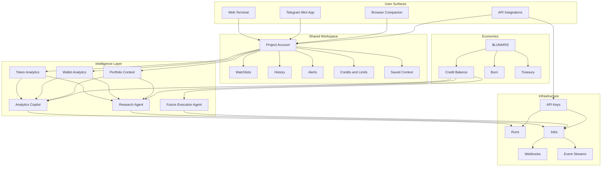

<p align="center">
  
</p>

<h1 align="center">Lunaris AI</h1>

<div align="center">
  <p><strong>AI-powered on-chain trading intelligence for Solana traders, analysts, and builders</strong></p>
  <p>
    Token analytics • Wallet profiling • Research agents • Cross-surface workflows • Credit-based access
  </p>
</div>

---

### 🚀 Quick Links

[](https://your-web-app-link)

[](https://t.me/your_mini_app)

[](https://your-docs-link)

[](https://x.com/your_account)

[](https://t.me/your_community)

---

> [!IMPORTANT]
> **Lunaris AI is available across multiple surfaces**
>  
> The web terminal is the main control center for deep token and wallet analysis, while the Telegram Mini App gives faster mobile access and the browser companion adds contextual checks directly on DEXes and explorers

## What’s Broken Today

Most on-chain workflows are still fragmented

Traders jump between charts, scanners, wallets, posts, bots, and spreadsheets just to answer a few basic questions that should be clear before any entry: is liquidity good enough, who is driving the move, how concentrated is supply, what kind of wallet activity sits behind the candle, and whether the risk fits the actual position size

Developers and analysts face a different version of the same problem. If they want to build dashboards, bots, or internal research flows, they usually have to assemble their own ingestion layer, normalize data, calculate wallet and token metrics, and then place some AI layer on top of it

Lunaris AI exists to compress this stack into one product surface and one programmable intelligence layer

| Workflow pain | What usually happens |
|---|---|
| Token research | Multiple tabs, mixed signals, no unified interpretation |
| Wallet analysis | PnL may be visible, but behavior and consistency stay unclear |
| Portfolio context | Exposure and concentration are rarely visible in one place |
| AI usage | Generic assistants do not understand on-chain structure |
| Automation | Teams rebuild the same APIs, jobs, and alert logic again and again |

> [!WARNING]
> **Lunaris is not a custodial trading app**
>  
> It does not store private keys, does not control user funds, and does not replace final execution approval by the wallet owner

---

## What Changes With This

Lunaris AI brings token intelligence, wallet analytics, and agent workflows into one connected system instead of treating them as separate tools

At the product level, it works as a shared intelligence workspace across web, Telegram, browser, and API. At the infrastructure level, it exposes the same engines to developers through project-based API keys, runs, jobs, webhooks, and event streams

Instead of giving users a generic chatbot, Lunaris works with structured trading context



### Core product layers

| Layer | Role inside Lunaris |
|---|---|
| Web Terminal | Full workspace for token, wallet, portfolio, alerts, and agent output |
| Telegram Mini App | Fast mobile checks and short AI responses inside Telegram |
| Browser Companion | In-context scans and quick explanations on DEXes and explorers |
| Agents Layer | Analytics Copilot, Research / Deep-Dive, later Automation / Execution |
| API Infrastructure | Project API keys, runs, jobs, webhooks, and event streams |
| $LUNARIS + Credits | Utility token model for plans, top-ups, and metered analytics usage |

---

## Proof It Works

Lunaris is designed around a simple shift

Instead of reading disconnected raw metrics and manually interpreting them, users get structured signals, labels, scores, and AI explanations tied to the exact token, wallet, or portfolio they are already looking at

A typical before-and-after looks like this

| Before Lunaris | With Lunaris |
|---|---|
| Check chart, scanner, wallet tracker, and social feed separately | Open one token or wallet view with metrics, scores, and agent context |
| See price and volume but miss behavior risk | See liquidity, concentration, volatility, wallet style, and clear risk framing |
| Use AI with weak context | Use AI grounded in Lunaris analytics and object-specific data |
| Build custom pipelines from scratch | Call the same engines through API and jobs |

### Example scenario

A trader notices a sudden move on a Solana token and wants to know whether it is worth touching

With Lunaris, that flow can stay inside one workspace: the token is scanned, liquidity and concentration are surfaced, wallet activity is classified, and the Analytics Copilot turns those metrics into a short explanation with a direct takeaway. If the token still looks interesting, the same user can request a deeper research brief or track related wallet behavior later

> [!TIP]
> **The strongest value appears when scans, context, and agents are used together**
>  
> Lunaris is not meant to be only a score screen or only an AI layer. The product is built around both pieces reinforcing each other

---

## Try the Core Flow

The shortest meaningful path in Lunaris is intentionally simple

1. Connect wallet  
2. Receive free credits  
3. Run a token or wallet scan  
4. Ask the Copilot what matters most  
5. Continue in web, Telegram, browser, or API depending on your workflow  

### First-result path

| Step | Action | Outcome |
|---|---|---|
| 1 | Connect wallet | Non-custodial login and account creation |
| 2 | Receive free credits | Immediate access to a limited trial flow |
| 3 | Scan token or wallet | Structured analytics and summary metrics |
| 4 | Ask Copilot | Natural-language explanation of risk, behavior, or exposure |
| 5 | Upgrade with $LUNARIS | More monthly credits and higher usage capacity |

> [!NOTE]
> **The free tier is meant for first validation**
>  
> Users can test token scans, wallet scans, and agent calls before moving into paid usage with $LUNARIS

---

## Real Scenarios

### For traders

A trader may want to know whether a token is actually tradable for their size, not just whether it is moving. Lunaris helps frame liquidity quality, volatility, holder concentration, and wallet-driven flow in one view, then lets the Copilot explain the main danger in plain language

### For analysts and builders

A team may need nightly research briefs, smart-wallet monitoring, or token-level filters for internal shortlists. Instead of building the full stack, they can use Lunaris APIs, jobs, and webhooks as the intelligence layer under existing tools

### For desks and funds

A desk may want one shared view of tracked tokens, wallet cohorts, alerts, and portfolio-level risk. Lunaris makes it easier to align traders, researchers, and PMs on the same metrics and the same interpretation layer

| User type | Typical use |
|---|---|
| Trader | Pre-entry token sanity check and wallet behavior review |
| Investor | Track consistent wallets instead of chasing random performance |
| Analyst | Build filtered token shortlists and monitor cohorts |
| Builder | Add explain-this-token or explain-this-wallet into internal tools |
| Team / Desk | Share alerts, briefs, and portfolio context across the group |

---

## Mechanics in Brief

Under the hood, Lunaris follows a structured pipeline instead of a prompt-only model

Raw chain and market inputs are ingested, normalized into a common schema, enriched with derived metrics, passed through scoring and classifiers, and only then exposed to users and agents



### Operational model

| Component | Function |
|---|---|
| Ingestion layer | Pulls on-chain and market data in near real time |
| Normalization | Converts multiple sources into consistent token, wallet, and trade objects |
| Derived metrics | Builds liquidity, holder, flow, volatility, and behavior features |
| Scoring layer | Produces token risk scores and wallet performance or behavior labels |
| Agent layer | Turns analytics into clear answers, briefs, and later execution logic |
| Delivery layer | Makes the same outputs available across app surfaces and API |

---

## Compared to Alternatives

Lunaris is not trying to be a generic assistant or just another scanner

It is closer to a programmable trading intelligence layer with product surfaces on top

| Alternative | Typical limitation | Lunaris difference |
|---|---|---|
| Generic AI chat | No native token or wallet structure | Works on top of structured on-chain analytics |
| Explorer + scanner combo | Metrics exist but interpretation is manual | Adds scores, classifiers, and AI explanation |
| Single-surface trading tool | Only works inside one interface | Shared system across web, Telegram, browser, and API |
| Custom internal stack | Expensive to build and maintain | Exposes ready-to-use analytics and agent infrastructure |

> [!IMPORTANT]
> **$LUNARIS is a utility token, not an equity representation**
>  
> It is used to purchase plans and credits that power scans, agents, and future automation flows across the platform

---

## Failure Cases

Lunaris is useful when the question depends on token structure, wallet behavior, exposure, or on-chain context

It is less useful when the user expects certainty in noisy markets or wants the product to replace judgment entirely

### When Lunaris is not the right tool

| Case | Why it is a poor fit |
|---|---|
| Blind trade confirmation | Lunaris highlights risk and context, not guaranteed outcomes |
| Fully custodial automation | The system is non-custodial and does not control wallets |
| Pure off-chain discretionary investing | The strongest value appears in on-chain analytics workflows |
| Users seeking only generic AI chat | Lunaris is built for trading intelligence, not broad conversation |

> [!CAUTION]
> **Lunaris should be used as a decision-support layer**
>  
> It helps users reason faster and with better context, but it does not remove market risk, liquidity constraints, execution slippage, or human error

---

## Product View

Lunaris AI is one workspace with multiple connected surfaces and one shared intelligence core



---

## Plans and Credit Model

Lunaris uses a plan-and-credits structure so access stays predictable across both UI and API usage

| Tier | Intended user | Credit model |
|---|---|---|
| Free | New users testing the platform | One-time starter credits |
| Starter | Individual traders | Monthly credits for regular analysis |
| Pro | Active users and power traders | Higher allowance and stronger daily capacity |
| Team / Desk | Funds, desks, and teams | Shared credit pool and broader automation usage |

Every paid tier is funded with **$LUNARIS**, and each purchase follows the same transparent split

| Payment flow | Result |
|---|---|
| User pays in $LUNARIS | Credits are issued to the account |
| 80% of payment | Burned |
| 20% of payment | Sent to treasury |
| Credits consumed | Token scans, wallet scans, Copilot, research, later execution logic |

---

## Developer Entry

Lunaris is also a platform for teams who want to treat analytics and agents as infrastructure

| API area | Purpose |
|---|---|
| Token analytics | Scan and fetch token-level intelligence |
| Wallet analytics | Profile behavior, PnL, and consistency |
| Agents runs | Fast synchronous agent calls |
| Agents jobs | Longer research and deep-dive tasks |
| Webhooks | Push updates when scans or jobs complete |
| Event streams | Pull-based integration for workers and pipelines |

Minimal authentication model

```bash
curl -X GET "https://api.lunaris.ai/v1/projects/me"   -H "Authorization: Bearer YOUR_API_KEY"   -H "Content-Type: application/json"
```

> [!NOTE]
> **API keys are project-scoped**
>  
> Keys provide access to analytics and can consume credits, but they do not provide access to private keys or direct fund control

---

## Closing View

Lunaris AI is built for a simple shift in on-chain work

Less tab-hopping  
Less manual interpretation  
Less generic AI guessing  

More structured context  
More usable token and wallet intelligence  
More ways to move from analytics to decisions across web, Telegram, browser, and code

---
